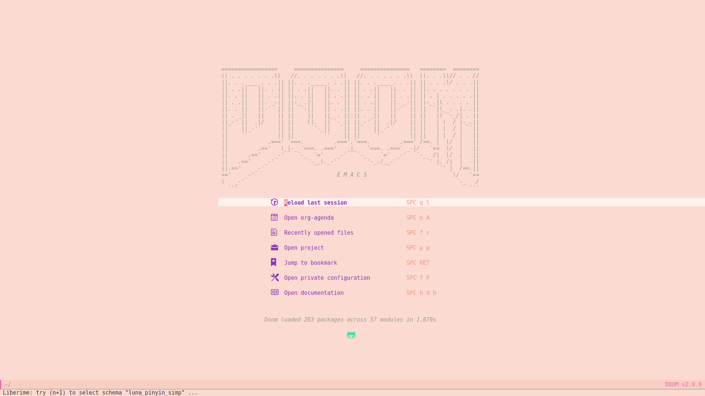
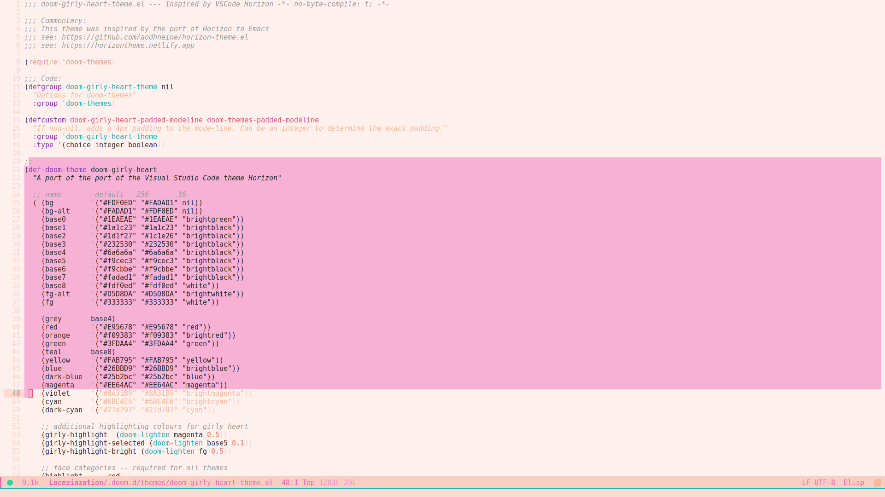

# Girly Heart





A theme for doom emacs

# Usage

Put `doom-girly-heart-theme.el` into `~/.doom.d/themes/`

And then add below to your `config.el`

``` emacs-lisp
(setq doom-theme 'doom-girly-heart)
```


